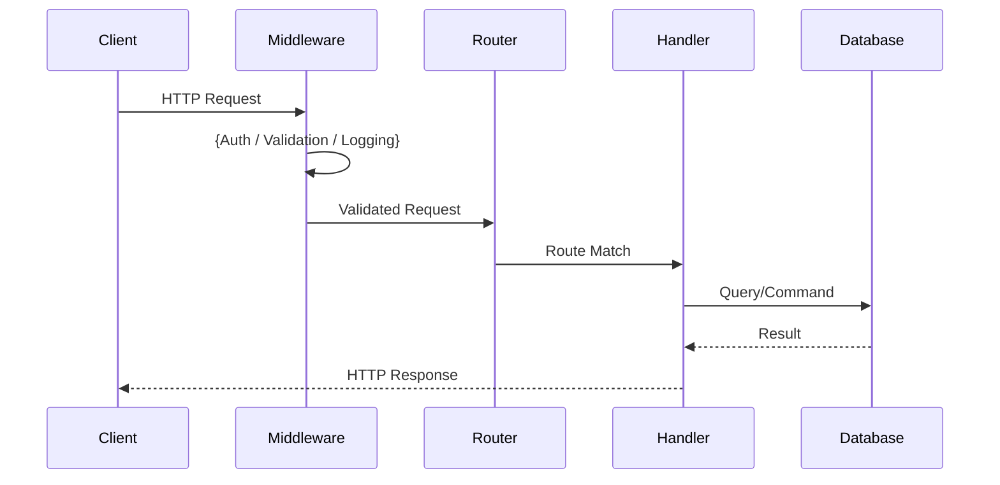

# API Documentation: {product_name}

> **Project:** {project_name}
> **Date:** {date}
> **Author:** {agent_name}
> **Mode:** Brownfield — discovered from codebase scan

## 1. API Overview

{Brief description of the API layer: framework used, routing approach, middleware stack, versioning strategy.}

## 2. OpenAPI Spec Status

| Item | Status |
|------|--------|
| Existing OpenAPI/Swagger spec found | {Yes / No} |
| Spec location | {path or N/A} |
| Spec version | {OpenAPI 2.0 / 3.0 / 3.1 / N/A} |
| Validation result | {Valid / Stale — X endpoints missing / N/A} |
| Generated from code scan | {Yes — needs manual review / No — existing spec used} |

## 3. Swagger/OpenAPI Specification

{If an existing spec was found, include validated/updated version here.}
{If no spec exists, generate an OpenAPI 3.x spec from route definitions, types/DTOs, and middleware.}
{Flag generated specs with: "Generated from code scan — needs manual review."}

```yaml
openapi: 3.0.3
info:
  title: "{product_name} API"
  version: "{api_version}"
paths:
  {generated_or_discovered_paths}
components:
  schemas:
    {generated_or_discovered_schemas}
```

## 4. Endpoint Inventory

| Method | Path | Handler | Auth | Description | Status |
|--------|------|---------|------|-------------|--------|
| {GET/POST/...} | {/api/resource} | {handler_name} | {auth_type} | {description} | {Documented / Undocumented} |

## 5. Request/Response Schemas

### 5.1 {Resource Name}

**Request:**
```json
{request_schema}
```

**Response:**
```json
{response_schema}
```

## 6. Authentication & Authorization

| Aspect | Implementation |
|--------|---------------|
| Auth strategy | {JWT / OAuth2 / API Key / Session / None} |
| Token location | {Header / Cookie / Query param} |
| Role-based access | {Yes — roles listed / No} |
| Rate limiting | {Yes — config / No} |

## 7. Error Response Format

```json
{
  "error": {
    "code": "{error_code}",
    "message": "{error_message}",
    "details": "{additional_context}"
  }
}
```

{Describe the standard error format used across the API. Note any inconsistencies.}

## 8. API Flow Diagram



## 9. Undocumented Endpoints (Gaps)

| Method | Path | Issue | Recommended Action |
|--------|------|-------|-------------------|
| {method} | {path} | {Missing docs / Missing validation / No error handling} | {action} |
