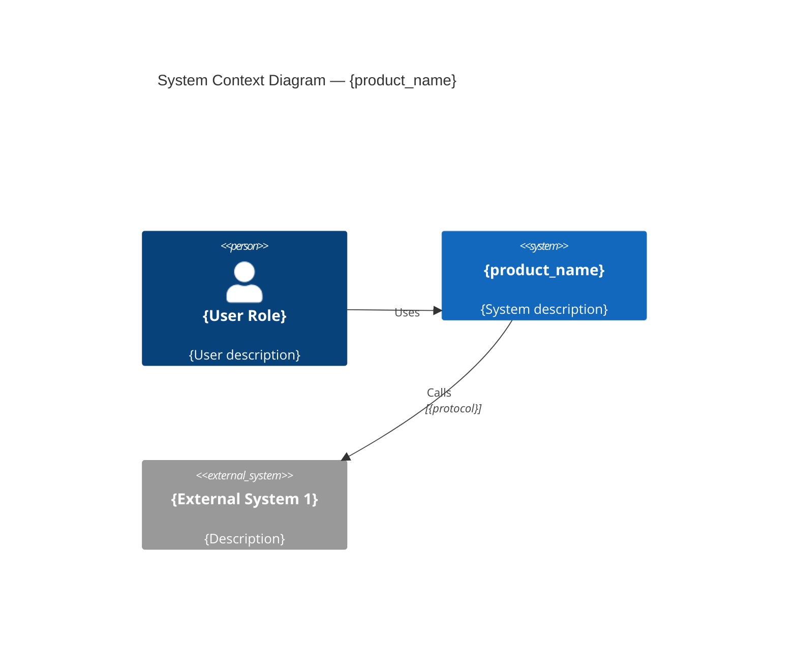
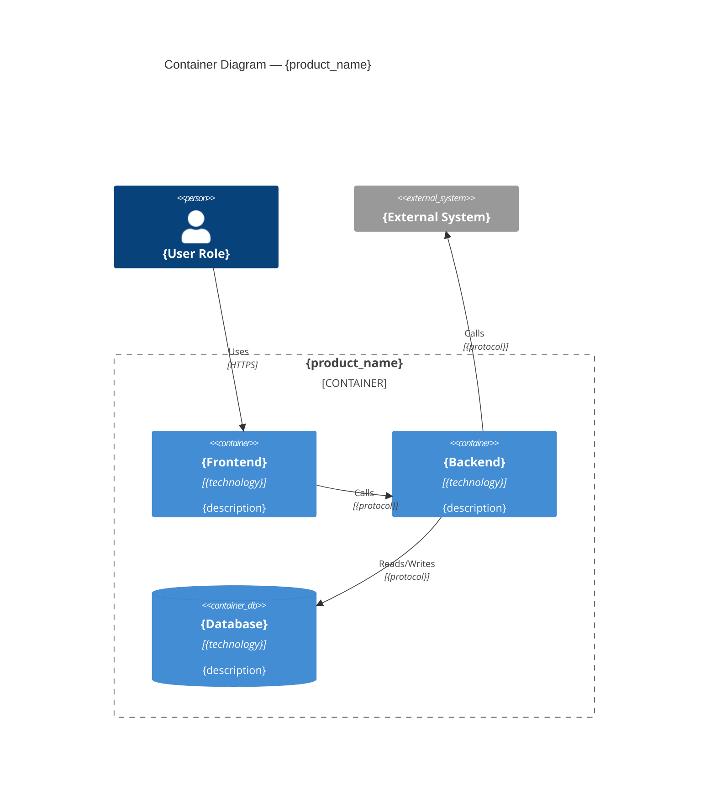
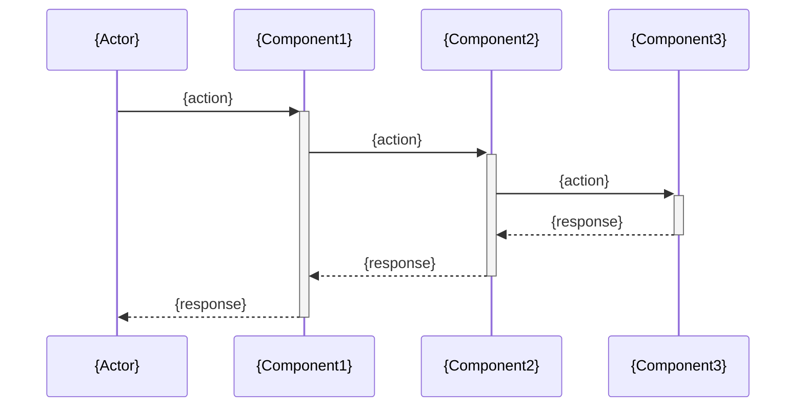
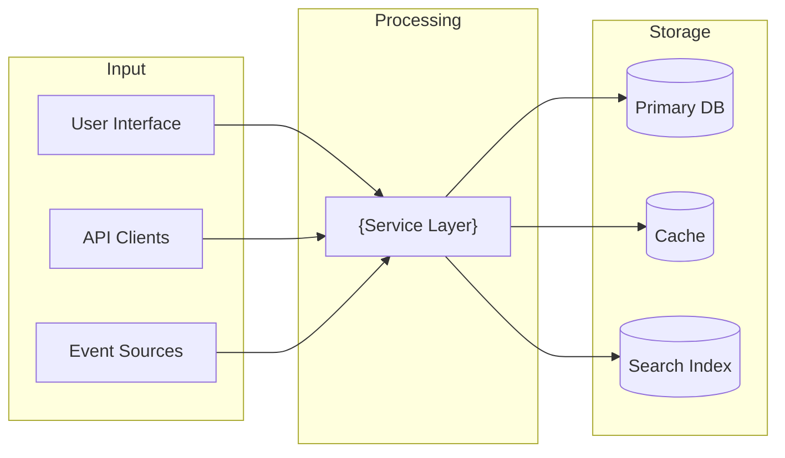

# Architecture Document: {product_name}

> **Project:** {project_name}
> **Date:** {date}
> **Author:** {agent_name}
> **Mode:** Brownfield — as-is discovered, target proposed for gaps

## 1. System Overview

{High-level description of the system: purpose, domain, scale, deployment model. Summarize what was discovered during project scan.}

## 2. Architecture Decisions

| ID | Decision | Rationale | Status | Source |
|----|----------|-----------|--------|--------|
| ADR-01 | {decision} | {why} | {Existing / Proposed} | {discovered from code / proposed for gaps} |

## 3. As-Is System Architecture

### System Context (C4 Level 1)



### Container Diagram (C4 Level 2)



## 4. Key System Flows

{Document 3-5 key flows using Mermaid sequence diagrams. Focus on the most important or complex flows.}

### Flow 1: {Flow Name}



### Flow 2: {Flow Name}

```mermaid
sequenceDiagram
    {sequence_diagram_content}
```

### Flow 3: {Flow Name}

```mermaid
sequenceDiagram
    {sequence_diagram_content}
```

## 5. Data Architecture

### Current Data Model

{Describe key entities, their relationships, and storage locations.}

| Entity | Storage | Key Fields | Relationships |
|--------|---------|-----------|---------------|
| {entity} | {table/collection} | {key fields} | {relations} |

### Data Flow Diagram



## 6. Integration Architecture

{Cross-reference the detailed documentation:}

- **API layer:** See [API Documentation](api-documentation.md) for full endpoint inventory and OpenAPI spec
- **Event architecture:** See [Event Catalog](event-catalog.md) for producer/consumer mapping
- **External dependencies:** See [Dependency Map](dependency-map.md) for service contracts and SLAs

### Integration Summary

| Integration | Type | Protocol | Direction | Documentation |
|------------|------|----------|-----------|--------------|
| {integration} | {API / Event / DB / File} | {REST / gRPC / Kafka / etc.} | {In / Out / Both} | {link to detailed doc} |

## 7. Infrastructure & Deployment

| Aspect | Current State |
|--------|--------------|
| Hosting | {cloud provider / on-prem / hybrid} |
| Containerization | {Docker / Kubernetes / none} |
| CI/CD | {pipeline description} |
| Environments | {dev / staging / prod} |
| Scaling model | {horizontal / vertical / fixed} |
| CDN | {provider or none} |

## 8. Security Architecture

| Layer | Implementation |
|-------|---------------|
| Authentication | {mechanism and provider} |
| Authorization | {RBAC / ABAC / custom} |
| Data encryption | {at rest / in transit / both / none} |
| Secrets management | {vault / env vars / config files} |
| API security | {rate limiting / CORS / CSP} |

## 9. Cross-Cutting Concerns

| Concern | Current Implementation | Gaps |
|---------|----------------------|------|
| Logging | {framework / approach} | {gaps if any} |
| Monitoring | {tools / dashboards} | {gaps if any} |
| Error handling | {strategy / patterns} | {gaps if any} |
| Configuration | {env vars / config files / feature flags} | {gaps if any} |
| Internationalization | {i18n approach or none} | {gaps if any} |

## 10. Target Architecture (Gaps)

{Describe architectural changes needed to close the gaps identified in the PRD.}

### Target vs. As-Is Delta

| Area | As-Is | Target | Change Required |
|------|-------|--------|----------------|
| {area} | {current state} | {desired state} | {what needs to change} |

### Migration Strategy

{How to get from as-is to target. Sequence of changes, risk mitigation, rollback plan.}

## 11. Risks and Mitigations

| Risk | Impact | Likelihood | Mitigation |
|------|--------|-----------|-----------|
| {risk} | {High / Medium / Low} | {High / Medium / Low} | {mitigation strategy} |
