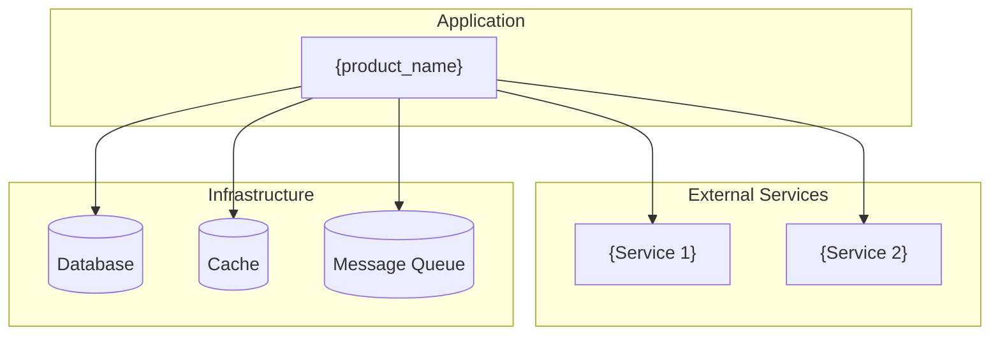

# Dependency Map: {product_name}

> **Project:** {project_name}
> **Date:** {date}
> **Author:** {agent_name}
> **Mode:** Brownfield — discovered from codebase scan

## 1. External Service Dependencies

| Service | Purpose | Protocol | Auth | Health Check | Error Handling |
|---------|---------|----------|------|-------------|----------------|
| {service_name} | {what it provides} | {REST / gRPC / GraphQL} | {API key / OAuth / mTLS} | {endpoint or N/A} | {retry / circuit breaker / fallback} |

## 2. Infrastructure Dependencies

| Component | Technology | Version | Purpose | Configuration |
|-----------|-----------|---------|---------|---------------|
| Database | {PostgreSQL / MySQL / MongoDB / etc.} | {version} | {primary data store / cache / etc.} | {config path} |
| Cache | {Redis / Memcached / etc.} | {version} | {session / query cache / etc.} | {config path} |
| Search | {Elasticsearch / Solr / etc.} | {version} | {full-text search / analytics} | {config path} |
| Storage | {S3 / GCS / local / etc.} | {N/A} | {file uploads / static assets} | {config path} |

## 3. Key Library Dependencies

| Library | Version | Current Latest | Purpose | CVE Risk |
|---------|---------|---------------|---------|----------|
| {library_name} | {installed_version} | {latest_version} | {ORM / Auth / State mgmt / etc.} | {None / CVE-XXXX-XXXX} |

## 4. Dependency Graph

## 5. Contracts & SLAs

| Dependency | Contract Type | SLA | Fallback Strategy |
|-----------|--------------|-----|-------------------|
| {dependency_name} | {REST API / Event schema / DB schema} | {uptime / latency target} | {degrade gracefully / fail fast / cached fallback} |

## 6. Risks & Recommendations

| Risk | Severity | Affected Dependency | Recommendation |
|------|----------|-------------------|----------------|
| {Version out of date} | {High / Medium / Low} | {dependency} | {upgrade path} |
| {No health check} | {Medium} | {dependency} | {add circuit breaker} |
| {Single point of failure} | {High} | {dependency} | {add redundancy} |
