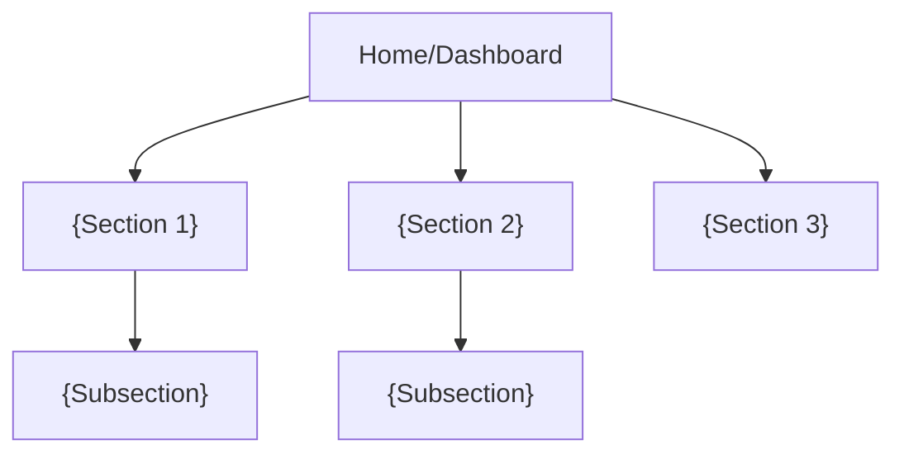

# UX Design Assessment: {product_name}

> **Project:** {project_name}
> **Date:** {date}
> **Author:** {agent_name}
> **Mode:** Brownfield — assessed from existing codebase

## 1. UX Overview

{Brief description of the application's user-facing surface: what type of UI, who uses it, primary user flows.}

## 2. Existing UI Patterns

### Component Library

| Aspect | Detail |
|--------|--------|
| UI framework | {React / Angular / Vue / Flutter / SwiftUI / etc.} |
| Component library | {Material UI / Ant Design / custom / none} |
| Design system | {documented / partial / none} |
| Styling approach | {CSS Modules / Tailwind / Styled Components / SCSS / etc.} |
| Theming | {dark mode / custom themes / none} |

### Layout Patterns

| Pattern | Usage | Consistency |
|---------|-------|-------------|
| Page layout | {sidebar + content / top nav / etc.} | {consistent / varies} |
| Grid system | {CSS Grid / Flexbox / framework grid} | {consistent / varies} |
| Responsive design | {breakpoints defined / partial / not responsive} | {details} |
| Spacing system | {design tokens / ad-hoc values} | {consistent / varies} |

## 3. Navigation Structure

{Describe the navigation model: sidebar, top nav, breadcrumbs, tabs, routing structure.}

## 4. Interaction Patterns

### Forms

| Pattern | Implementation | Consistency |
|---------|---------------|-------------|
| Form validation | {client-side / server-side / both} | {consistent / varies} |
| Error display | {inline / toast / summary} | {consistent / varies} |
| Submit handling | {optimistic / loading state / blocking} | {consistent / varies} |
| Multi-step forms | {wizard / tabs / none} | {details} |

### Modals & Dialogs

| Pattern | Implementation | Consistency |
|---------|---------------|-------------|
| Confirmation dialogs | {standard pattern / ad-hoc} | {consistent / varies} |
| Modal management | {portal / overlay / framework modal} | {consistent / varies} |
| Keyboard handling | {Escape to close / focus trap / none} | {details} |

### Notifications & Feedback

| Pattern | Implementation | Consistency |
|---------|---------------|-------------|
| Success feedback | {toast / banner / inline} | {consistent / varies} |
| Error feedback | {toast / modal / inline / error boundary} | {consistent / varies} |
| Loading states | {skeleton / spinner / progress bar} | {consistent / varies} |
| Empty states | {placeholder / illustration / message} | {consistent / varies} |

## 5. Accessibility Assessment

| Criteria | Status | Details |
|----------|--------|---------|
| Target WCAG level | {A / AA / AAA / Unknown} | {documented requirement or inferred} |
| ARIA usage | {comprehensive / partial / minimal / none} | {examples} |
| Semantic HTML | {consistent / partial / div-heavy} | {examples} |
| Keyboard navigation | {full support / partial / broken} | {details} |
| Focus management | {visible focus rings / custom / missing} | {details} |
| Color contrast | {passes AA / fails / untested} | {details} |
| Screen reader tested | {yes / no} | {details} |
| a11y tooling | {axe / Lighthouse / pa11y / none} | {config path} |

## 6. UX Gap Analysis

| Gap | Severity | Affected Area | Current State | Desired State |
|-----|----------|--------------|---------------|---------------|
| {Missing responsive design} | {High / Medium / Low} | {pages affected} | {desktop only} | {responsive} |
| {Inconsistent error handling} | {Medium} | {forms} | {varies by page} | {unified pattern} |
| {Accessibility violations} | {High} | {navigation} | {no ARIA labels} | {WCAG AA} |

## 7. Proposed UX Improvements

{Only for gap features identified in the PRD. Do not propose changes to working, acceptable patterns.}

### 7.1 {Improvement Area}

- **Current state:** {what exists now}
- **Proposed change:** {what should change}
- **Rationale:** {why this matters for gap features}
- **Affected components:** {list of components to modify}

## 8. Wireframe Descriptions

{Text-based descriptions of new or significantly modified screens for gap features only.}

### 8.1 {Screen Name}

- **Purpose:** {what this screen does}
- **Layout:** {describe the layout structure}
- **Key components:** {list the main UI elements}
- **Interactions:** {describe key user interactions}
